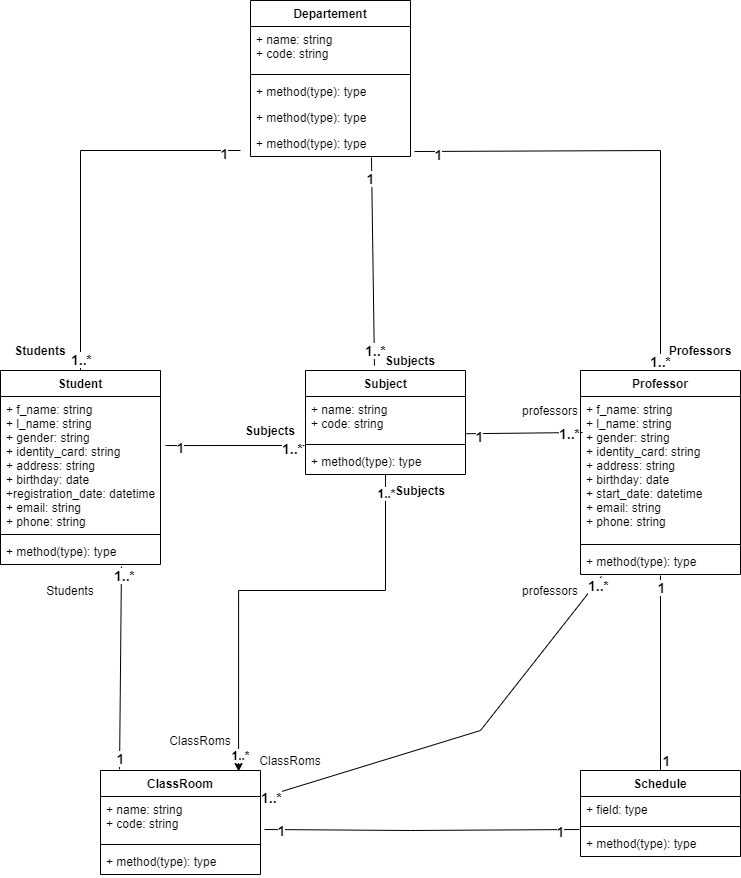
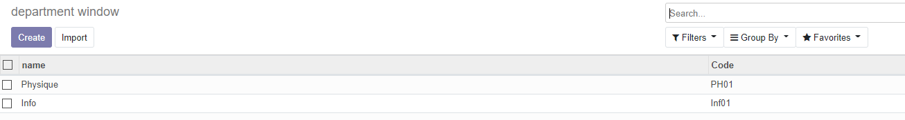
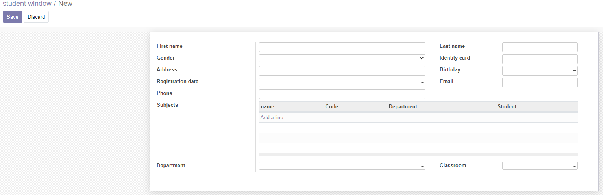
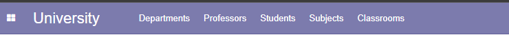
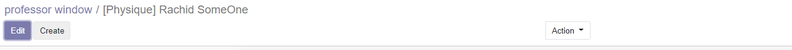

# About university modul
University modul is an open source modul built with odoo V12 for University Management purpose.  
The modul has be developed on Windows Os Environment using Pycharm.  

# Run locally 
* Create new Dir : `c:\\program files (x86)\\odoo 12.0\\server\\odoo\\myaddons`
* Update addons Dir : `odoo.config`: `addons_path = C:\Program Files (x86)\Odoo 12.0\server\odoo\addons,C:\Program Files (x86)\Odoo 12.0\server\addons,C:\Program Files (x86)\Odoo 12.0\server\odoo\myaddons`
* Pycharm run config: `parameters: -c odoo.conf`
* Run the project, will be listening on  http://localhost:8069/  

# Technologies
1. Python V3.6+
2. PostgresSql

# Features
The modul provides the administrators to manage the university esily.  
1. Departments
2. Professors
3. Students
4. Subjects
5. Classrooms

# Modul Class Diagram

# Views type
1. List view  

2. Form view  

# Implemented options
1. Sequence of menu  

2. Computed fields  

3. Constraints  
  
4. Customizing the navigator

# Technical
* @api (one, multim onchange) decorators
* Entity relationship (one2many, many2many, many2one)
* Selection fields
* Warning
* Raising Error
* Constraints
* Security

# Modul folders
1. `Controllers` : contains set of controllers in order to hanlde the request.
2. `Demo` : for demo data.
3. `Models` : DbModels (Department, students, classroom ...).
4. `readme` : media for *readme.md* - documentation.
5. `Security` : Contains *.csv* file where to define access rights for endusers.
4. `Static` : for external resources (Js, css ...).
5. `Views` : refers to UI pages *.xml* files.
